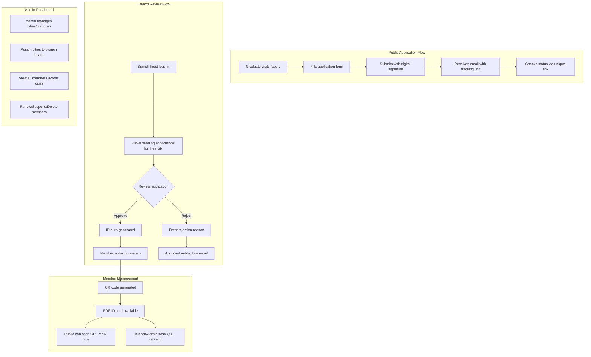

# Veterinary Syndicate Membership System

## Overview

This feature adds a complete membership application and management system for veterinary graduates to join the syndicate, with city-based branch approval workflow and digital ID cards with QR verification.

## Architecture



## Database Schema Changes

Add to [`lib/db/schema.ts`](lib/db/schema.ts):

### New Tables

**1. Cities Table** - Admin-managed list of syndicate branch cities

```typescript
cities: {
  id, nameEn, nameKu, code, isActive, createdAt
}
```

**2. Vet Applications Table** - Stores all membership applications

```typescript
vetApplications: {
  id, trackingToken (unique UUID for status checking),
  // Personal info
  fullNameKu, fullNameEn, dateOfBirth, nationalIdNumber, nationalIdIssueDate,
  nationality, marriageStatus, numberOfChildren, bloodType,
  // Education & Work
  collegeCertificateBase64, collegeFinishDate, educationLevel,
  yearsAsEmployee, jobType, jobLocation,
  // Contact
  currentLocation, phoneNumber, emailAddress, cityId (FK to cities),
  // Verification
  confirmationChecked, signatureBase64, photoBase64,
  // Status
  status (pending/approved/rejected), rejectionReason,
  reviewedBy, reviewedAt, createdAt
}
```

**3. Vet Members Table** - Approved members with ID info

```typescript
vetMembers: {
  id, applicationId (FK), memberId (auto-generated: 00001, 00002...),
  // Copied from application for ID card
  fullNameKu, fullNameEn, titleEn, titleKu, dateOfBirth, photoBase64,
  // ID details
  qrCodeId (unique), issueDate, expiryDate,
  // Status
  status (active/suspended/expired), suspensionReason,
  // Management
  cityId, createdBy, updatedAt, updatedBy
}
```

**4. Branch Assignments Table** - Links admin users to cities

```typescript
branchAssignments: {
  id, userId (FK to adminUsers), cityId (FK to cities), createdAt
}
```

**5. Member Renewal Requests Table** - Track renewal requests

```typescript
renewalRequests: {
  id, memberId (FK), requestedAt, status (pending/approved/rejected),
  processedBy, processedAt, notes
}
```

### Schema Modifications

Update `adminUsers` table to support branch head role:

```typescript
roleEnum: ["syndicate", "clinic", "branch_head"]
```

## New API Endpoints

| Endpoint | Method | Access | Purpose |

|----------|--------|--------|---------|

| `/api/vet-applications` | POST | Public | Submit new application |

| `/api/vet-applications/status/[token]` | GET | Public | Check application status |

| `/api/vet-applications` | GET | Branch/Admin | List applications (filtered by city for branch) |

| `/api/vet-applications/[id]/approve` | POST | Branch/Admin | Approve application |

| `/api/vet-applications/[id]/reject` | POST | Branch/Admin | Reject with reason |

| `/api/vet-members` | GET | Branch/Admin | List members |

| `/api/vet-members/[id]` | GET/PUT/DELETE | Branch/Admin | Manage member |

| `/api/vet-members/[id]/suspend` | POST | Branch/Admin | Suspend member |

| `/api/vet-members/[id]/renew` | POST | Branch/Admin | Renew membership |

| `/api/vet-members/[id]/id-card` | GET | Branch/Admin | Generate PDF ID card |

| `/api/vet-members/qr/[qrCodeId]` | GET | Public | Get member info for QR scan |

| `/api/cities` | CRUD | Admin only | Manage cities |

| `/api/branch-assignments` | CRUD | Admin only | Assign cities to branch heads |

| `/api/renewal-requests` | GET/POST | Member (via link) | Request renewal |

## New Pages

### Public Pages

- **`/apply`** - Membership application form with all 20+ fields, canvas signature, file uploads
- **`/application-status/[token]`** - Check application status, view rejection reason, request renewal if member

### Branch Head Pages (under `/branch`)

- **`/branch/dashboard`** - Overview: pending applications count, member stats for their city
- **`/branch/applications`** - List pending/all applications for their assigned city
- **`/branch/applications/[id]`** - Review application detail, approve/reject
- **`/branch/members`** - List members in their city with search/filter
- **`/branch/members/[id]`** - View/edit member, renew ID, suspend
- **`/branch/renewals`** - Pending renewal requests

### Admin Pages (extend existing `/syndicate`)

- **`/syndicate/cities`** - CRUD for cities/branches
- **`/syndicate/branch-users`** - Create branch head accounts, assign cities
- **`/syndicate/vet-applications`** - View all applications across cities
- **`/syndicate/vet-members`** - View all members across cities

### QR Scan Page

- **`/verify/[qrCodeId]`** - Public view of member (name, title, photo, ID, valid/expired)
  - If user is logged in as branch/admin: show edit button

## Components to Create

- **`VetApplicationForm.tsx`** - Large form with all fields, validation, signature canvas
- **`SignatureCanvas.tsx`** - Canvas component for drawing digital signature
- **`ApplicationStatusCard.tsx`** - Shows current status, rejection reason if rejected
- **`ApplicationReviewCard.tsx`** - For branch/admin to review and approve/reject
- **`VetMemberCard.tsx`** - Display member info with actions
- **`VetMemberIDCard.tsx`** - Visual representation of the ID card (front/back)
- **`MemberQRView.tsx`** - Public view when QR is scanned
- **`CitySelector.tsx`** - Dropdown for city selection
- **`RenewalRequestForm.tsx`** - For members to request renewal

## ID Card Generation

Use **jsPDF** or **@react-pdf/renderer** to generate printable PDF:

**Front of card:**

- Full Name (Kurdish + English)
- Title
- Date of Birth
- Photo

**Back of card:**

- Member ID Number (auto: 00001, 00002...)
- Issue Date
- Expiry Date (Issue + 1 year)
- QR Code (links to `/verify/[qrCodeId]`)

## Email Notifications

Integrate email sending (using existing setup or add Resend/Nodemailer):

1. **Application submitted** - Send tracking link to applicant
2. **Application approved** - Notify with congratulations + link to view ID
3. **Application rejected** - Notify with reason + link to view status
4. **ID expiring soon** - Reminder 30 days before expiry
5. **Renewal approved** - Confirm new expiry date

## Key Implementation Files

| File | Purpose |

|------|---------|

| [`lib/db/schema.ts`](lib/db/schema.ts) | Add new tables and enums |

| `lib/email/send.ts` | Email sending utility (new) |

| `lib/id-generator.ts` | Generate sequential member IDs (new) |

| `lib/pdf/id-card.ts` | PDF generation for ID cards (new) |

| [`lib/auth/auth.ts`](lib/auth/auth.ts) | Add branch_head role support |

| [`middleware.ts`](middleware.ts) | Add `/branch` route protection |

## Security Considerations

- Rate limit public application endpoint
- Validate file uploads (size, type)
- Sanitize all user inputs
- Tracking tokens are UUID v4 (unguessable)
- Branch heads can only access their assigned city's data
- Public QR view shows minimal info, hides suspended members

## Dependencies to Add

```json
{
  "jspdf": "^2.5.1",
  "qrcode": "^1.5.3",
  "uuid": "^9.0.0",
  "nodemailer": "^6.9.0" // or "@resend/node" for Resend
}
```